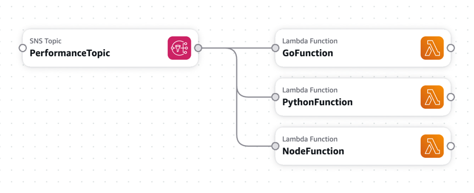

# AWS sns fan out to 3 lambda functions written in 3 languages
This repo contains 3 lambda func that are written each in different language (Go, Python, Nodejs) and we have a SAM config that provisions SNS and 3 lambda functions such that when a event is published to SNS all 3 lambda func get triggered 

## Learn:
https://docs.aws.amazon.com/serverless-application-model/latest/developerguide/serverless-sam-cli-install.html

## Required IAM Roles:

cloudformation:CreateChangeSet
s3:CreateBucket
iam:DetachRolePolicy


``` text
AWS 
      SAM(
          SNS Topic
             |
             |--- Lambda (Go)
             |--- Lambda (Python)
             |--- Lambda (Node.js)
       )
```
SNS → fan-out → all three Lambdas run in parallel



## Step 0: Setup

```cmd 
    brew install awscli
    brew install aws-sam-cli
    brew install --cask docker
    brew install go
    brew install python@3.9
    brew install node@24
```

```cmd 
    aws configure
```
## Step 1: Build & Deploy

```cmd 
    sam build
    sam deploy --guided
```

## Step 2: Publish a Message to SNS

```cmd 
    aws sns list-topics

```

```cmd
    aws sns publish \
  --topic-arn <YOUR_TOPIC_ARN> \
  --message "Hello performance test"

```

```cmd 
aws sns publish \
  --topic-arn <ARN> \
  --message '{"testRun":"1","payload":"hello"}'

```

## Command line output:

```cmd 
ravieragapati@Mac aws-sns-lambda-sam % sam build
Building codeuri: /Users/ravieragapati/MyPOC/aws-sns-lambda-sam/python runtime: python3.9 architecture: x86_64 functions: PythonFunction                               
requirements.txt file not found. Continuing the build without dependencies.                                                                                            
 Running PythonPipBuilder:CopySource                                                                                                                                   
Building codeuri: /Users/ravieragapati/MyPOC/aws-sns-lambda-sam/node runtime: nodejs24.x architecture: x86_64 functions: NodeFunction                                  
package.json file not found. Continuing the build without dependencies.                                                                                                
 Running NodejsNpmBuilder:CopySource                                                                                                                                   
Building codeuri: /Users/ravieragapati/MyPOC/aws-sns-lambda-sam/go runtime: provided.al2023 architecture: x86_64 functions: GoFunction                                 
GoFunction: Running CustomMakeBuilder:CopySource                                                                                                                       
GoFunction: Running CustomMakeBuilder:MakeBuild                                                                                                                        
GoFunction: Current Artifacts Directory : /Users/ravieragapati/MyPOC/aws-sns-lambda-sam/.aws-sam/build/GoFunction                                                      
GOOS=linux GOARCH=amd64 CGO_ENABLED=0 \
        go build -o /Users/ravieragapati/MyPOC/aws-sns-lambda-sam/.aws-sam/build/GoFunction/bootstrap main.go

Build Succeeded

Built Artifacts  : .aws-sam/build
Built Template   : .aws-sam/build/template.yaml

Commands you can use next
=========================
[*] Validate SAM template: sam validate
[*] Invoke Function: sam local invoke
[*] Test Function in the Cloud: sam sync --stack-name {{stack-name}} --watch                                                                                           
[*] Deploy: sam deploy --guided 
```

```cmd 
ravieragapati@Mac aws-sns-lambda-sam % sam deploy         

        Managed S3 bucket: aws-sam-cli-managed-default-samclisourcebucket-idkapebkpcjc
        Auto resolution of buckets can be turned off by setting resolve_s3=False
        To use a specific S3 bucket, set --s3-bucket=<bucket_name>
        Above settings can be stored in samconfig.toml
                                                                                                                                                                       
        File with same data already exists at sam-app/6afdb4a28c227b0df256a49bfcd4596d, skipping upload                                                                
                                                                                                                                                                       
        File with same data already exists at sam-app/178e68d61de8b6815b23de01940c78c5, skipping upload                                                                
                                                                                                                                                                       
        File with same data already exists at sam-app/cf0313ec801c56e761d48bc543b2036c, skipping upload                                                                

        Deploying with following values                                                                                                                                
        ===============================                                                                                                                                
        Stack name                   : sam-app
        Region                       : us-east-1
        Confirm changeset            : False
        Disable rollback             : False
        Deployment s3 bucket         : aws-sam-cli-managed-default-samclisourcebucket-idkapebkpcjc
        Capabilities                 : ["CAPABILITY_IAM"]
        Parameter overrides          : {}
        Signing Profiles             : {}

Initiating deployment                                                                                                                                                  
=====================                                                                                                                                                  
                                                                                                                                                                       
                                                                                                                                                                       
        File with same data already exists at sam-app/3cdd7159264057ae07420e0c7a60ceae.template, skipping upload                                                       


Waiting for changeset to be created..

CloudFormation stack changeset
-----------------------------------------------------------------------------------------------------------------------------------------------------------------
Operation                                LogicalResourceId                        ResourceType                             Replacement                            
-----------------------------------------------------------------------------------------------------------------------------------------------------------------
+ Add                                    GoFunctionRole                           AWS::IAM::Role                           N/A                                    
+ Add                                    GoFunctionSNSEventPermission             AWS::Lambda::Permission                  N/A                                    
+ Add                                    GoFunctionSNSEvent                       AWS::SNS::Subscription                   N/A                                    
+ Add                                    GoFunction                               AWS::Lambda::Function                    N/A                                    
+ Add                                    NodeFunctionRole                         AWS::IAM::Role                           N/A                                    
+ Add                                    NodeFunctionSNSEventPermission           AWS::Lambda::Permission                  N/A                                    
+ Add                                    NodeFunctionSNSEvent                     AWS::SNS::Subscription                   N/A                                    
+ Add                                    NodeFunction                             AWS::Lambda::Function                    N/A                                    
+ Add                                    PerformanceTopic                         AWS::SNS::Topic                          N/A                                    
+ Add                                    PythonFunctionRole                       AWS::IAM::Role                           N/A                                    
+ Add                                    PythonFunctionSNSEventPermission         AWS::Lambda::Permission                  N/A                                    
+ Add                                    PythonFunctionSNSEvent                   AWS::SNS::Subscription                   N/A                                    
+ Add                                    PythonFunction                           AWS::Lambda::Function                    N/A                                    
-----------------------------------------------------------------------------------------------------------------------------------------------------------------
                                                                                                                                                                       

Changeset created successfully. arn:aws:cloudformation:us-east-1:122610509877:changeSet/samcli-deploy1769835631/d285fc7b-70da-4a33-8f51-8f58cadffd50


2026-01-31 00:00:37 - Waiting for stack create/update to complete

CloudFormation events from stack operations (refresh every 5.0 seconds)
-----------------------------------------------------------------------------------------------------------------------------------------------------------------
ResourceStatus                           ResourceType                             LogicalResourceId                        ResourceStatusReason                   
-----------------------------------------------------------------------------------------------------------------------------------------------------------------
CREATE_IN_PROGRESS                       AWS::CloudFormation::Stack               sam-app                                  User Initiated                         
CREATE_IN_PROGRESS                       AWS::IAM::Role                           NodeFunctionRole                         -                                      
CREATE_IN_PROGRESS                       AWS::IAM::Role                           GoFunctionRole                           -                                      
CREATE_IN_PROGRESS                       AWS::IAM::Role                           PythonFunctionRole                       -                                      
CREATE_IN_PROGRESS                       AWS::SNS::Topic                          PerformanceTopic                         -                                      
CREATE_IN_PROGRESS                       AWS::SNS::Topic                          PerformanceTopic                         Resource creation Initiated            
CREATE_IN_PROGRESS                       AWS::IAM::Role                           GoFunctionRole                           Resource creation Initiated            
CREATE_IN_PROGRESS                       AWS::IAM::Role                           NodeFunctionRole                         Resource creation Initiated            
CREATE_IN_PROGRESS                       AWS::IAM::Role                           PythonFunctionRole                       Resource creation Initiated            
CREATE_COMPLETE                          AWS::SNS::Topic                          PerformanceTopic                         -                                      
CREATE_COMPLETE                          AWS::IAM::Role                           GoFunctionRole                           -                                      
CREATE_COMPLETE                          AWS::IAM::Role                           PythonFunctionRole                       -                                      
CREATE_COMPLETE                          AWS::IAM::Role                           NodeFunctionRole                         -                                      
CREATE_IN_PROGRESS                       AWS::Lambda::Function                    GoFunction                               -                                      
CREATE_IN_PROGRESS                       AWS::Lambda::Function                    PythonFunction                           -                                      
CREATE_IN_PROGRESS                       AWS::Lambda::Function                    NodeFunction                             -                                      
CREATE_IN_PROGRESS                       AWS::Lambda::Function                    GoFunction                               Resource creation Initiated            
CREATE_IN_PROGRESS                       AWS::Lambda::Function                    PythonFunction                           Resource creation Initiated            
CREATE_IN_PROGRESS                       AWS::Lambda::Function                    NodeFunction                             Resource creation Initiated            
CREATE_COMPLETE                          AWS::Lambda::Function                    PythonFunction                           -                                      
CREATE_COMPLETE                          AWS::Lambda::Function                    NodeFunction                             -                                      
CREATE_IN_PROGRESS                       AWS::Lambda::Permission                  PythonFunctionSNSEventPermission         -                                      
CREATE_IN_PROGRESS                       AWS::SNS::Subscription                   PythonFunctionSNSEvent                   -                                      
CREATE_IN_PROGRESS                       AWS::Lambda::Permission                  NodeFunctionSNSEventPermission           -                                      
CREATE_IN_PROGRESS                       AWS::SNS::Subscription                   NodeFunctionSNSEvent                     -                                      
CREATE_COMPLETE                          AWS::Lambda::Function                    GoFunction                               -                                      
CREATE_IN_PROGRESS                       AWS::Lambda::Permission                  PythonFunctionSNSEventPermission         Resource creation Initiated            
CREATE_IN_PROGRESS                       AWS::Lambda::Permission                  GoFunctionSNSEventPermission             -                                      
CREATE_IN_PROGRESS                       AWS::SNS::Subscription                   NodeFunctionSNSEvent                     Resource creation Initiated            
CREATE_IN_PROGRESS                       AWS::SNS::Subscription                   PythonFunctionSNSEvent                   Resource creation Initiated            
CREATE_IN_PROGRESS                       AWS::Lambda::Permission                  NodeFunctionSNSEventPermission           Resource creation Initiated            
CREATE_IN_PROGRESS                       AWS::SNS::Subscription                   GoFunctionSNSEvent                       -                                      
CREATE_COMPLETE                          AWS::Lambda::Permission                  PythonFunctionSNSEventPermission         -                                      
CREATE_COMPLETE                          AWS::Lambda::Permission                  NodeFunctionSNSEventPermission           -                                      
CREATE_COMPLETE                          AWS::SNS::Subscription                   NodeFunctionSNSEvent                     -                                      
CREATE_COMPLETE                          AWS::SNS::Subscription                   PythonFunctionSNSEvent                   -                                      
CREATE_IN_PROGRESS                       AWS::Lambda::Permission                  GoFunctionSNSEventPermission             Resource creation Initiated            
CREATE_IN_PROGRESS                       AWS::SNS::Subscription                   GoFunctionSNSEvent                       Resource creation Initiated            
CREATE_COMPLETE                          AWS::Lambda::Permission                  GoFunctionSNSEventPermission             -                                      
CREATE_COMPLETE                          AWS::SNS::Subscription                   GoFunctionSNSEvent                       -                                      
CREATE_COMPLETE                          AWS::CloudFormation::Stack               sam-app                                  -                                      
-----------------------------------------------------------------------------------------------------------------------------------------------------------------
                                                                                                                                                                       

Successfully created/updated stack - sam-app in us-east-1

```
