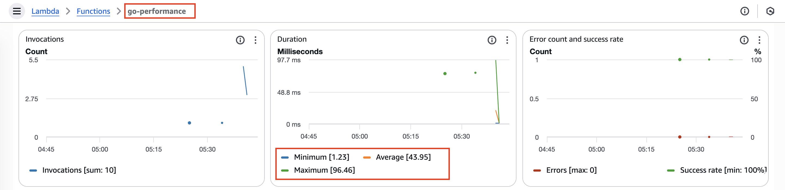
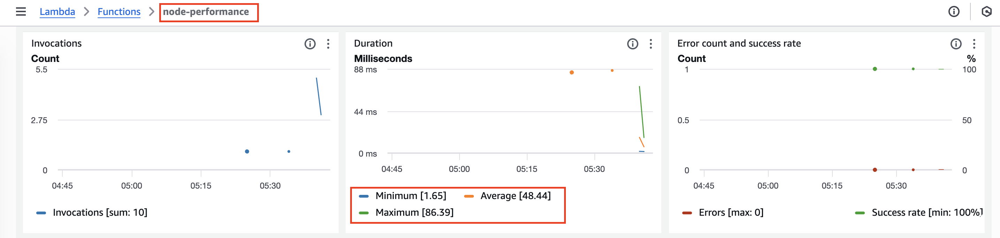

## Go lang metrics

## Nodejs metrics

## Python metrics

* Clearly based on metrics dashboard  Python < Goland < Node (cold start)
* For the 5th request Go and python performed same but Node was .4 ms slow then go and python
* But Logs tell different story - go is .11 ms faster than python to initilize
    - may be the metrics is looking at start to end. may be infra delay 